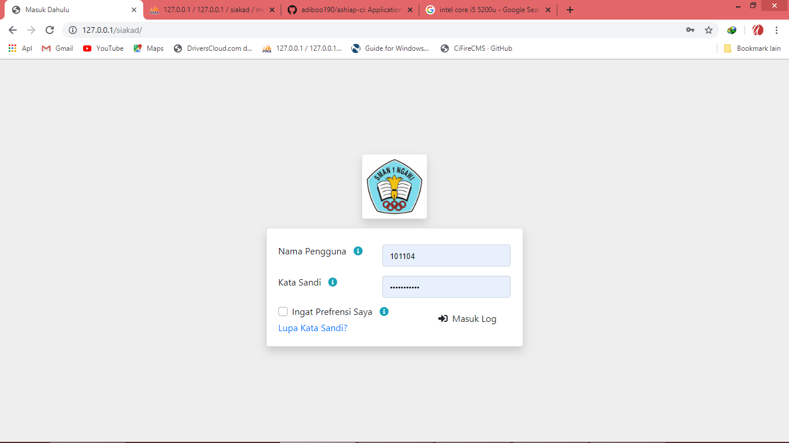

# Ashiap Codeigniter (Automattic SIAKAD Apps)

Ashiap merupakan aplikasi berbasis Codeigniter yang digunakan untuk SIAKAD (Sistem Informasi dan akademis) SMA atau SMK. Versi ini masih belum stabil karena masih ada banyak sekali bug.

*******************
Server Requirements
*******************

<table>
	<tr>
		<td>Sistem Operasi</td>
		<td>Windows 7 Keatas</td>
	</tr>
	<tr>
		<td>SoftWare</td>
		<td>Apache2, Nginx, MySQL, MSSQL dll.</td>
	</tr>
	<tr>
		<td>PHP</td>
		<td>7.3.0</td>
	</tr>
</table>

**********
Pemasangan
**********

1. Pasang dengan mengunduh semua file diatas dengan cara <pre>git clone	https://github.com/adiboo190/smasa-project.git</pre>.
2. Taruh ke folder bawaan apache kamu. <pre>C:\xampp\htdocs</pre> atau <pre>/var/www/html</pre>
3. Koneksikan database di {ROOT_APPS}/application/config/database.php
4. Atur URL di {ROOT_APPS}/application/config/config.php
5. Impor databasenya yang berformat .sql

**************
Username Login
**************

user : 101104 & 2003-02-19
